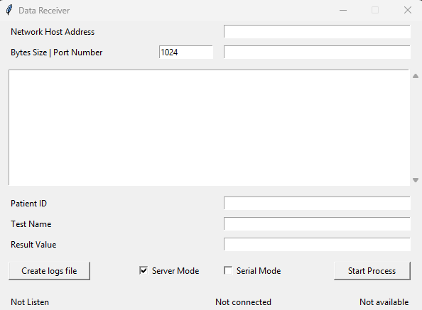
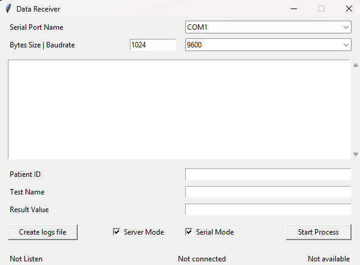

# 🛰️ Data Receiver Windows  

### A lightweight Python-based GUI application for real-time data reception over Network or Serial communication


## 🧭 Overview

**Data Receiver Windows** is a simple yet powerful **Python GUI tool** built using **Tkinter**.  
It allows users to receive and log data either from a **network (TCP/IP)** connection or a **serial port** connection.  

This tool is particularly useful for **device communication testing**, **data monitoring** and **medical or industrial analyzers** where real-time data reception and logging are essential.


## ⚙️ Features

✅ Dual Mode Support:
- **Network Mode** → Connect using host IP & port  
- **Serial Mode** → Connect to COM ports with custom baud rates  

✅ Real-time Monitoring:
- View received byte data in a scrollable text box  
- Log output directly to a `.txt` file  

✅ Flexible Parameters:
- Input custom patient/test data for organized logs  
- Adjustable byte size and baud rate  

✅ Modern GUI:
- Clean and responsive Tkinter-based interface  
- Dynamic UI updates depending on selected mode  

✅ File Management:
- Save logs instantly with a timestamp-based filename  


## 🧩 Tech Stack

| Component | Description |
|------------|-------------|
| **Language** | Python 3.9+ |
| **GUI Library** | Tkinter (`Default`) |
| **Modules Used** | `tkinter`, `tkinter.ttk`, `tkinter.scrolledtext`, `time` |
| **Platform** | Windows, Linux, MacOS |


## 🖥️ User Interface

**Default main interface (Network Mode)**<br/>
<br/>
**Serial mode with COM port and baud rate options**



## 🚀 How to Run

Tkinter comes pre-installed with Python, so no extra libraries are required.  
But you can ensure dependencies are met:

- Python 3.9 or higher  
- Windows or Linux or MacOS

```bash
# 1️. clone this repository
git clone https://github.com/iamx-ariful-islam/data-receiver-window.git

# 2️. move into the project folder
cd data-receiver-window

# 3️. Run the application `python Main.py` file
```


## 🧠 How It Works

1. Launch the application.
2. Choose between Network Mode or Serial Mode using the checkbox.
3. Enter the connection details (host/port or COM/baudrate).
4. Show Patient ID, Test Name and Result Value after parsing bytes data.
5. Click Start Process to begin receiving data.
6. Click Create Logs File to save the received bytes into a .txt file (auto timestamped).


## 📁 Project Structure
Here’s the structure of the **Data Receiver Window** project:

```bash
data-receiver-windows/
│
├── screenshots/           # Screenshot (default interface)
│
├── LICENSE                # MIT License
├── Main.py                # Main GUI application file
└── README.md              # Project documentation
```


## Contributing

Contributions, suggestions and feedback are always welcome! ❤️
To contribute:

1. Fork the repository
2. Create a new branch (`feature/new-feature`)
3. Commit your changes
4. Push and submit a Pull Request

💬 You can also open an issue if you’d like to discuss a feature or report a bug.


## For more or connect with me

<p align='center'>
  <a href="https://github.com/iamx-ariful-islam"></a>&nbsp;&nbsp;&nbsp;&nbsp;
  <a href="https://x.com/mx_ariful_islam"></a>&nbsp;&nbsp;&nbsp;&nbsp;
  <a href="https://bd.linkedin.com/in/iamx-ariful-islam"></a>&nbsp;&nbsp;&nbsp;&nbsp;
  <a href="https://www.facebook.com/jonakisoft.net/"></a>&nbsp;&nbsp;&nbsp;&nbsp;
</p>


## License

The [MIT](https://choosealicense.com/licenses/mit/) License (MIT)


<h2 align="center">💖 Thank You for Visiting!</h2>

<p align="center">
  “Good design is about making things simple yet significant”<br>
  — <a href="https://github.com/iamx-ariful-islam" target="_blank"><strong>Md. Ariful Islam</strong></a>
</p>